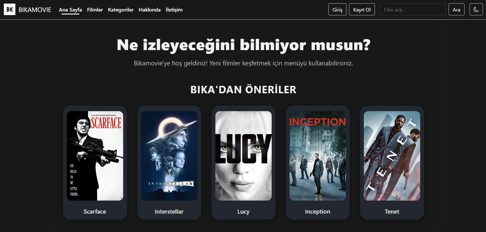
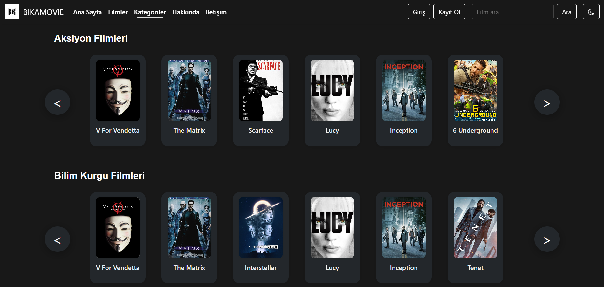
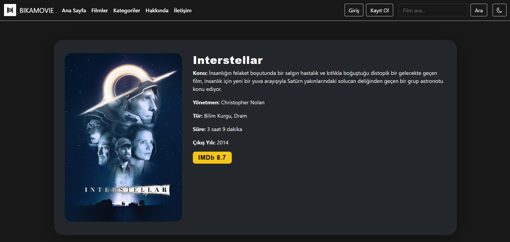
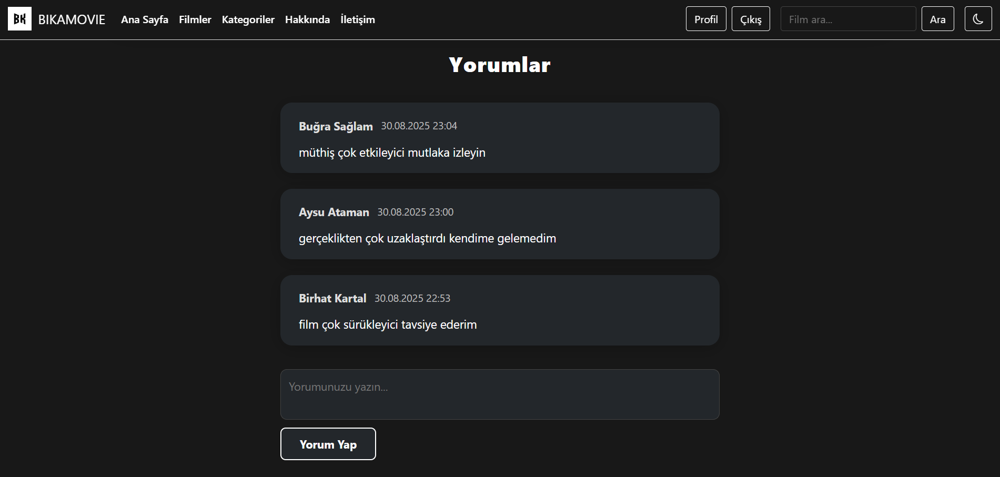
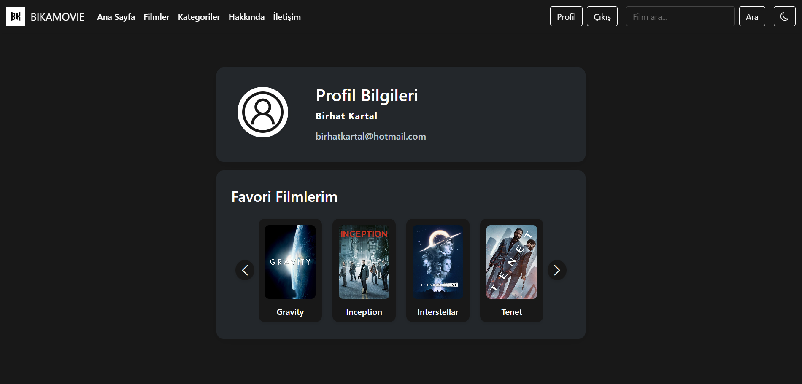

# BIKAMOVIE

**Bikamovie**: Film öneri ve Analiz Sitesi

## Proje Amacı

Bikamovie, kullanıcıların filmleri kategorilere göre keşfedebileceği, detaylı bilgi ve analizlere ulaşabileceği, favorilerini saklayıp yorum yapabileceği bir film öneri platformudur.

## Kullanılan Teknolojiler

- **Frontend:** HTML, CSS, JavaScript
- **Backend:** C#

## Öne Çıkan Özellikler

- Film kategorileri
- Film arama
- Film detayları (konu, yönetmen, imdb vb.)
- Yorum yapma ve yorumları görüntüleme
- Favorilere film ekleme/çıkarma
- Kayıt olma ve giriş/çıkış yapma
- Profil sayfası
- Koyu/Açık mod desteği
- Modern ve kullanıcı dostu arayüz

## Ekran Görüntüleri

Aşağıda projenin arayüzüne dair örnek ekran görüntüleri bulabilirsiniz:

## Ana Sayfa

## Kategoriler

## Film Detayı

## Yorumlar

## Profil

## Kurucu

**Proje sahibi:** Birhat Kartal - [kartalbirhat](https://github.com/kartalbirhat)
